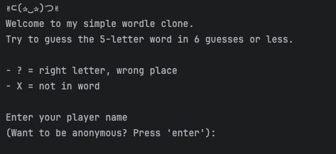
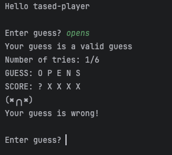
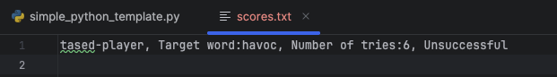

# wordle-clone

---

Project to create a wordle-like clone in python.

Use the simple_python_template.py

## Project requirements

- [x] Develop a plan for implementation of the game
- [x] Document and create an algorithm for scoring the accuracy of guesses
- [x] Develop a solution including documentation and testing
- [x] Be adaptable and responsive to change
- [x] Have a score file created to track high scores
- [x] Have a player input username, with default for anonymous preference

### Screenshot of opening of the game

### Screenshot of scoring of the game

### Screenshot of the end of the game

### Screenshot of the output of the score file

